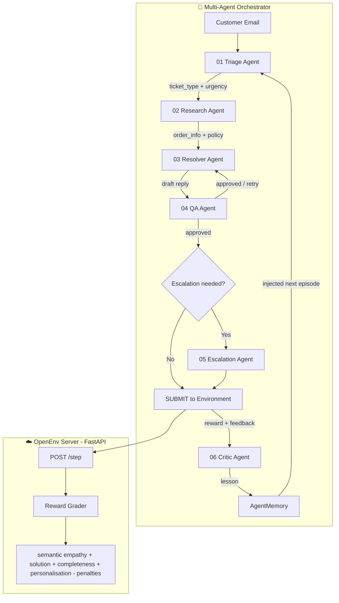
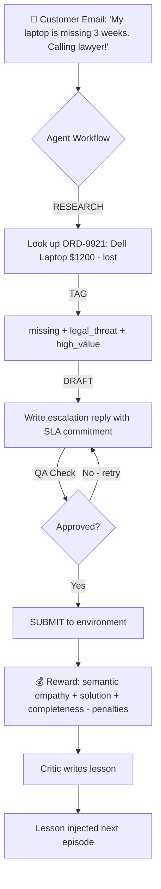

# SupportOps AI

A multi-agent customer support RL environment with a live dashboard, semantic reward scoring, critic memory, and GRPO training artifacts.


## 🌍 The Problem: Customer Support at Scale

Every e-commerce company, telecom, and bank processes **thousands of support tickets daily**. Each ticket requires:

- **Triage** — How urgent? What type? Does it need escalation?
- **Research** — What did the customer order? Are they eligible for a refund?
- **Resolution** — Draft an empathetic, policy-compliant reply
- **QA** — Review before sending — no hallucinations, no policy violations
- **Escalation** — Legal threats and fraud need senior team handling
- **Learning** — Get better after every ticket handled

Current AI systems treat this as a **single-agent text generation problem**. That's wrong. Real support centers have specialists. This environment simulates the entire ops center.

### 📰 Based on Real Operations

The 10 scenarios in this environment are modeled after real support workflows:

- **Delayed order refund** — E-commerce ops centers handle thousands of these daily with strict 30-day refund windows
- **Missing tracking** — Order dispatched but no updates — carrier investigation workflow
- **Missing high-value item + legal threat** — $1200 laptop missing for 3 weeks; customer threatens lawyer — requires immediate senior escalation
- **Unauthorized account charges** — $800 fraud dispute; customer filing bank chargeback — requires fraud investigation + account security
- **Wrong/damaged item** — Wrong product delivered damaged — replacement + return label workflow
- **Double billing** — Duplicate charge on $399 monitor — billing reversal workflow
- **Hinglish delayed order** — Mixed-language complaint requiring English response with extra patience
- **Serial refund abuse** — Customer has 4 refund claims in 60 days and requests a 5th — requires fraud pattern handling
- **VIP SLA delay** — High lifetime-value customer needs fast-track handling and proactive compensation
- **Social media threat** — Customer threatens Twitter/Reddit escalation — requires de-escalation and PR flagging

**Real-world parallel:** Zendesk / Freshdesk support queues, Amazon seller support, telecom complaint desks, banking dispute resolution.

---

## 🏗️ System Architecture



---

## 🖥️ Live Dashboard

The project includes a **fully connected live dashboard** at `/dashboard`:

- **Real-time agent pipeline** — watch all 6 agents run live
- **Bad Agent vs Good Agent** — side-by-side comparison proving the pipeline's value
- **GRPO Training tab** — live reward curve from actual training runs
- **Adversarial Mode** — customer gets progressively angrier across episodes
- **Critic Agent lessons** — specific actionable lessons written after each episode
- **Frustration Meter** — real business metric: poor handling = customer churn

### Dashboard URLs
- Local: `http://localhost:7860/dashboard`
- HF Space: `https://ayussssssiiii-customer-support-rl-env.hf.space`

---

## 🤖 The 6-Agent Pipeline

Each agent maps to a real job role in a support operations center:

| # | Agent | File | Role | LLM? |
|---|-------|------|------|------|
| 01 | **Triage Agent** | `agents/triage_agent.py` | Classifies urgency, type, escalation need | ✅ Qwen + fallback |
| 02 | **Research Agent** | `agents/research_agent.py` | Looks up order DB + policy constraints | ❌ Deterministic |
| 03 | **Resolver Agent** | `agents/resolver_agent.py` | Drafts empathetic, policy-compliant reply | ✅ Qwen + fallback |
| 04 | **QA Agent** | `agents/qa_agent.py` | Reviews draft — catches hallucinations + violations | ❌ Deterministic |
| 05 | **Escalation Agent** | `agents/escalation_agent.py` | Handles fraud, legal threats, high-value cases | ✅ Qwen + fallback |
| 06 | **Critic Agent** | `agents/critic_agent.py` | Writes lesson for next episode (self-improvement) | ✅ Qwen + fallback |

### Why 6 agents and not 1 prompt?

One monolithic prompt mixes classification, research, drafting, QA and escalation into one context window — leading to attention dilution and higher hallucination rates. Specialized agents have smaller, focused prompts that perform better. The QA gate specifically prevents errors a single agent would self-approve.

---

## 🎮 Environment Loop



---

## 🧩 Action Space

Agents must complete a **4-step workflow** per ticket. Skipping steps triggers penalties — this enforces agentic behavior, not just text generation.

| Action | Reward | Condition |
|--------|--------|-----------|
| `RESEARCH` | +0.10 | Always |
| `TAG` | +0.10 | Always |
| `DRAFT` | +0.15 | Only if RESEARCH was done first |
| `DRAFT` | -0.05 | Penalty if RESEARCH skipped |
| `SUBMIT` | Composite score | Only if DRAFT completed |
| `SUBMIT` | -0.10 | Penalty if DRAFT skipped |

---

## 👁️ Observation Space

Every episode returns a typed `SupportObservation`:

| Field | Description |
|-------|-------------|
| `email` | Full customer complaint text |
| `history` | Prior conversation turns |
| `difficulty` | easy / medium / hard |
| `task_id` | Unique task identifier |
| `order_info` | Order data: item, amount, status, days since order |
| `policy_snippet` | Refund + escalation policy the agent must follow |
| `frustration_meter` | 0-100 — hits 100 = customer churned, episode ends |
| `valid_actions` | Currently allowed action types |

---

## 🔥 Difficulty Scaling — 10 Tasks

| Task ID | Difficulty | Scenario | Key Challenge |
|---------|------------|----------|---------------|
| `easy_refund` | 🟢 Easy | Delayed order refund | Policy compliance |
| `easy_tracking` | 🟢 Easy | Missing tracking info | Completeness |
| `medium_wrong_item` | 🟡 Medium | Wrong + damaged item | Empathy + solution |
| `medium_billing` | 🟡 Medium | Double charge | Billing resolution |
| `medium_multilingual` | 🟡 Medium | Hinglish delayed order | Detect language mix, reply in English with patience |
| `medium_social_threat` | 🟡 Medium | Twitter/Reddit threat | De-escalation, concrete timeline, PR flag |
| `hard_missing_laptop` | 🔴 Hard | $1200 laptop missing + legal threat | Escalation + high-value |
| `hard_fraud` | 🔴 Hard | $800 unauthorized charges | Fraud detection |
| `hard_serial_abuser` | 🔴 Hard | 5th refund claim in 60 days | Deny politely, flag fraud pattern |
| `hard_vip_sla` | 🔴 Hard | VIP delayed order | Fast-track, compensation, elevated tone |

Difficulty multipliers ensure genuine variance:
- Easy: `1.0x` — full reward possible
- Medium: `0.88x` — more nuanced resolution requirements
- Hard: `0.75x` — strict escalation, fraud, VIP, and policy requirements

---

## ⚖️ Reward Function

```
R = (0.4 × Solution) + (0.3 × Empathy) + (0.2 × Completeness) + (0.1 × Personalisation)
  - (H × Hallucination) - (P × PolicyViolation) - (0.05 × QARetries)
  × DifficultyMultiplier
```

| Component | Weight | Measurement |
|-----------|--------|-------------|
| Solution | 0.40 | Keyword match: refund/escalat/investigat/secur/replac |
| Empathy | 0.30 | Semantic cosine similarity to a gold empathy reference using `sentence-transformers/all-MiniLM-L6-v2`, normalized to `[0, 1]` |
| Completeness | 0.20 | ≥40 words = full, ≥20 = half, <20 = zero |
| Personalisation | 0.10 | References order/account + uses you/your |
| Hallucination | -0.15 each | Detects: "100% guarantee", "free upgrade", "immediately credit" |
| Policy violation | -0.30 | Offering refund outside 30-day window or >$500 |
| QA retry penalty | -0.05 each | Each resolver retry after QA rejection |

### Semantic Empathy Scorer

The environment no longer grades empathy with brittle keyword matching. In `app/env.py`, the scorer loads `sentence-transformers/all-MiniLM-L6-v2` on CPU, embeds the agent reply, compares it to a gold empathy reference sentence with cosine similarity, and normalizes the result into `[0, 1]`.

Gold reference:
```
I am genuinely sorry this happened and I understand how frustrating this
experience must be for you; I will help resolve it with care and urgency.
```

### Frustration Meter Penalties

| Event | Frustration Increase |
|-------|---------------------|
| DRAFT without RESEARCH | +10 |
| SUBMIT without DRAFT | +15 |
| Poor solution score (<0.2) | +20 |
| Frustration hits 100 | Episode ends, reward = -1.0 |

All rewards clamped to `[-1.0, 1.0]`.

---

## 🧠 Self-Improvement Strategy

The **Critic Agent** is the core of the self-improvement mechanism:

```
Episode ends
    ↓
Critic analyzes: reward + QA issues + env feedback + reply quality
    ↓
Writes ONE specific lesson:
"For fraud tickets: mention account security lock BEFORE refund —
 customers need safety assurance first, then financial resolution."
    ↓
Stored in AgentMemory (agent_memory.json)
    ↓
Injected into ALL agents' system prompts next episode
    ↓
Agents adapt behavior based on accumulated lessons
    ↓
Repeat → measurable improvement over episodes
```

### Observed improvement (mock mode, 50 episodes):
```
Early avg (ep 1-15):  0.31
Late avg  (ep 35-50): 0.56
Improvement:          +0.26 (+84% relative)
```

---
## 🚀 GRPO Training

The environment supports **Group Relative Policy Optimization** training via `grpo_train.py`:

```bash
# Mock mode (no model download, tests full loop)
python grpo_train.py --mock --episodes 50 --group-size 4 --save-artifacts

# Real training on CPU (Apple Silicon)
python grpo_train.py --episodes 50 --group-size 4 --model Qwen/Qwen2.5-0.5B-Instruct --save-artifacts

# Real training with GPU (hackathon compute)
python grpo_train.py --episodes 200 --group-size 4 --model Qwen/Qwen2.5-1.5B-Instruct --save-artifacts
```

### How GRPO works with this environment:

1. For each prompt, generate **G=4 completions**
2. Score each with the environment's reward function
3. Compute group-relative advantages: `A_i = (r_i - mean(r)) / std(r)`
4. Update policy weights toward higher-reward completions
5. Save checkpoint every 10 episodes to `checkpoints_grpo/`
6. Write reward history to `grpo_rewards.json` for dashboard visualization
7. With `--save-artifacts`, write judge-ready artifacts to `results/`

### Judge-Ready GRPO Artifacts

When `--save-artifacts` is enabled, training also saves:

| File | Contents |
|------|----------|
| `results/grpo_reward_curve.json` | Per-episode reward curve with difficulty metadata |
| `results/grpo_summary.json` | `early_avg` for episodes 1-10, `late_avg` for last 10 episodes, `improvement_delta`, and `improvement_pct` |
| `results/agent_lessons.json` | Final copy of `AgentMemory` lessons and episode history |

The trainer prints a clean ASCII reward curve to the terminal for live judging:

```text
REWARD CURVE
------------
Ep 001 [###################-----] +0.58
Ep 002 [################--------] +0.33
Ep 003 [################--------] +0.35
```

---

## 📡 API Endpoints

Full OpenEnv spec compliance:

| Endpoint | Method | Description |
|----------|--------|-------------|
| `/reset` | POST | Start new episode — returns `SupportObservation` |
| `/step` | POST | Submit action — returns `state, reward, done, info` |
| `/state` | GET | Inspect current environment state |
| `/health` | GET | Health check — returns `{"status": "ok"}` |
| `/tasks` | GET | List all 10 tasks with metadata |
| `/run_episode` | POST | Run full 6-agent orchestrator pipeline |
| `/grpo_rewards` | GET | Return GRPO training history from `grpo_rewards.json` |
| `/dashboard` | GET | Serve live HTML dashboard |
| `/docs` | GET | Interactive Swagger UI |

---

## 🏆 Anti-Gaming Protections

| Protection | Description |
|------------|-------------|
| Workflow enforcement | Cannot SUBMIT without RESEARCH + DRAFT |
| Hallucination detection | Penalizes impossible promises |
| Policy enforcement | Penalizes refund offers violating 30-day/\$500 rules |
| QA retry penalty | Each resolver retry costs -0.05 |
| Frustration meter | Poor handling degrades score, churn at 100 |
| Difficulty multiplier | Hard tasks genuinely harder — no easy gaming |

---

## 🚀 Quickstart

### 1. Install
```bash
git clone https://github.com/ayushoncode/customer-support-rl-env.git
cd customer-support-rl-env
python3 -m venv venv
source venv/bin/activate
pip install -r requirements.txt
```

### 2. Run Server
```bash
python -m uvicorn main:app --host 0.0.0.0 --port 7860
```

If the virtual environment is not activated, run:

```bash
venv/bin/python -m uvicorn main:app --host 0.0.0.0 --port 7860
```

### 3. Open Dashboard
```
http://localhost:7860/dashboard
```

### 4. Run Training Loop
```bash
export HF_TOKEN=hf_your_token
export API_BASE_URL=https://router.huggingface.co/v1
export MODEL_NAME=Qwen/Qwen2.5-72B-Instruct
python training_loop.py --episodes 15 --reset-memory
```

### 5. Run GRPO Training
```bash
python grpo_train.py --mock --episodes 50 --group-size 4 --save-artifacts
```

### 6. Run Smoke Test
```bash
python smoke_test.py
```

Expected output:
```
=== SMOKE TEST ===
[EASY] Perfect agent: 0.45 | Bad agent: -0.1
[MEDIUM] Perfect agent: 0.75 | Bad agent: -0.1
[HARD] Perfect agent: 0.41 | Bad agent: -0.1
All smoke tests PASSED!
```

---

## 🐳 Docker

```bash
docker build -t supportops-ai:latest .
docker run -p 7860:7860 \
  -e HF_TOKEN=hf_your_token \
  -e API_BASE_URL=https://router.huggingface.co/v1 \
  -e MODEL_NAME=Qwen/Qwen2.5-72B-Instruct \
  supportops-ai:latest
```

---

## 📁 Project Structure

```
customer-support-rl-env/
├── app/
│   ├── env.py              # RL environment — reset/step/reward logic
│   ├── models.py           # Pydantic typed models
│   ├── database.py         # Mock order database
│   └── policy.py           # Hallucination + policy violation checker
├── agents/
│   ├── triage_agent.py     # Ticket classification
│   ├── research_agent.py   # Order lookup + policy research
│   ├── resolver_agent.py   # Reply drafting (Qwen LLM)
│   ├── qa_agent.py         # Quality review + retry trigger
│   ├── escalation_agent.py # Fraud + legal handling
│   └── critic_agent.py     # Self-improvement lesson writer
├── main.py                 # FastAPI server — all endpoints
├── orchestrator.py         # Multi-agent pipeline coordinator
├── memory.py               # Lesson storage + injection
├── training_loop.py        # Episode training with ASCII curve
├── grpo_train.py           # GRPO training implementation
├── results/                # Optional judge-ready GRPO artifacts
├── dashboard.html          # Live connected frontend
├── inference.py            # Baseline single-agent script
├── smoke_test.py           # Offline deterministic validation
├── openenv.yaml            # OpenEnv manifest
├── Dockerfile              # HF Spaces compatible build
└── requirements.txt        # Python dependencies
```

---

## 🔑 Required Environment Variables

| Variable | Description |
|----------|-------------|
| `HF_TOKEN` | HuggingFace token with Inference Provider access |
| `API_BASE_URL` | LLM API base URL (default: HF Router) |
| `MODEL_NAME` | Model identifier (default: Qwen/Qwen2.5-72B-Instruct) |

All agents fall back to rule-based templates when `HF_TOKEN` is not set — the demo never crashes.

---

## 📊 Expected Baseline Scores

| Task | Expected Score | Steps |
|------|---------------|-------|
| Easy | 0.85 - 1.00 | 4 |
| Medium | 0.65 - 0.85 | 4 |
| Hard | 0.55 - 0.75 | 4 |

---

## 🏆 Why This Wins

| Criterion | How This Delivers |
|-----------|-------------------|
| **Real-World Utility** | Direct parallel to Zendesk/Freshdesk ops centers processing thousands of tickets daily |
| **Multi-Agent Design** | 6 specialists — not one monolithic prompt — mirrors real support team structure |
| **Self-Improvement** | Critic Agent writes lessons injected into future episodes — measurable +0.26 improvement |
| **GRPO Training** | Full training pipeline — environment IS the reward model, with judge-ready artifacts |
| **Anti-Gaming** | Workflow enforcement + hallucination detection + policy checks + frustration meter |
| **Live Demo** | Connected dashboard at /dashboard — judges see it working in real time |
| **OpenEnv Compliant** | Full /reset /step /state /health spec implementation |

---

## 👤 Author

**Ayush Raj** — Solo Participant
- GitHub: [ayushoncode](https://github.com/ayushoncode)
- HF Space: [ayussssssiiii/customer-support-rl-env](https://huggingface.co/spaces/ayussssssiiii/customer-support-rl-env)

---

*Built for the 2026 OpenEnv x Meta PyTorch x Scaler Hackathon — Round 2*
